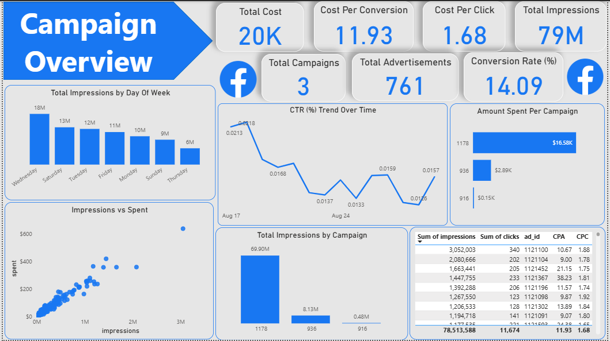
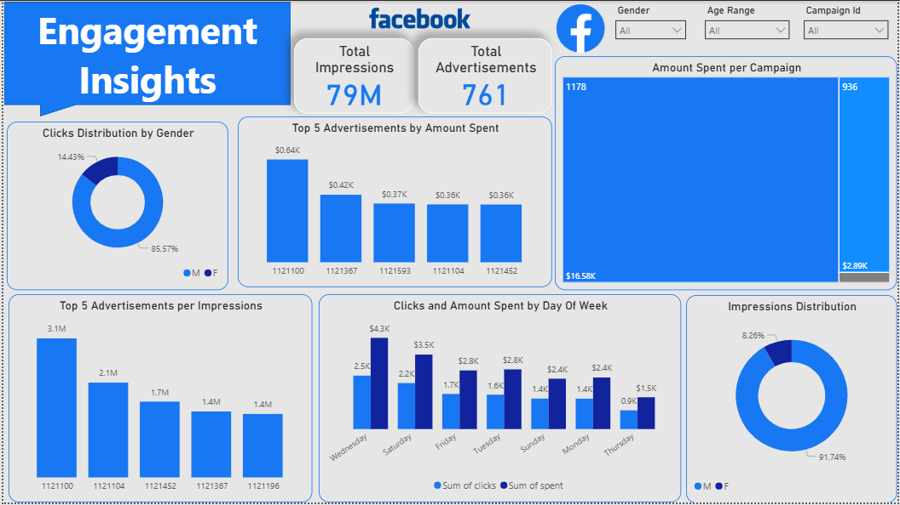

# 📣 Social Media Campaign Analytics Dashboard

## 📊 Introduction  
An interactive dashboard built to analyze **Facebook social media advertising campaigns**, enabling marketers to monitor campaign performance, audience engagement, and budget utilization through rich, intuitive visualizations.

---

## 🎯 Purpose  
This dashboard helps answer key marketing questions:  
- 📌 How effective are campaigns in terms of reach, clicks, and conversions?  
- 📆 What are the daily and temporal trends in impressions and engagement?  
- 👥 How does engagement vary by demographics like gender and age?  
- 💸 How is the advertising budget spent across campaigns and advertisements?

---

## 🚀 Features  

- **Key Metrics:** Total cost, cost per click (CPC), cost per acquisition (CPA), total impressions, conversion rate, counts of campaigns and advertisements.  
- **Trend Analysis:** Click-through rate (CTR) trends over time.  
- **Performance Breakdown:** Impressions and spend by campaign, day of week, and advertisement.  
- **Engagement Insights:** Distribution of clicks by gender, top advertisements by spend and impressions, plus clicks and spend by day.  
- **Interactive Filters:** Filter insights by gender, age range, and campaign ID.

---

## 📈 Analysis Highlights

- Impressions peak midweek (Wednesday ~18M).  
- One campaign consumes the majority of spend ($16.58K), far exceeding others.  
- Males generate the highest click volume (85.57%).  
- A small set of ads dominate impressions and budget.  
- CTR exhibits daily fluctuations, indicating changing engagement levels.

---

## 💡 Recommendations  

- Prioritize budgeting on high-traffic days like Wednesday and Saturday.  
- Adjust targeting strategies considering gender and age distribution.  
- Reallocate budgets toward top-performing campaigns and ads.  
- Monitor CTR trends to continuously optimize ad content and placement.

---

## 🧾 Conclusion  
This dashboard delivers a comprehensive, data-driven view of Facebook campaign performance, engagement, and spending patterns, empowering marketers with actionable insights for optimizing social media advertising strategies and improving ROI.

---

## 📷 Sample Dashboard Visuals  

### Campaign Overview  
  

### Engagement Insights  
  

---

## 📂 Repository Contents  
- `dashboard_file` – Interactive dashboard source file (Power BI)  
- `image_1` – Facebook campaign overview  
- `image_2` – Facebook campaign engagement insights  
- `README.md` – This documentation  

---

## 🧠 Skills Demonstrated  
- Social media campaign data analysis  
- Interactive data visualization  
- Demographic segmentation  
- Advertising budget and performance evaluation  
- Data storytelling with visual analytics
